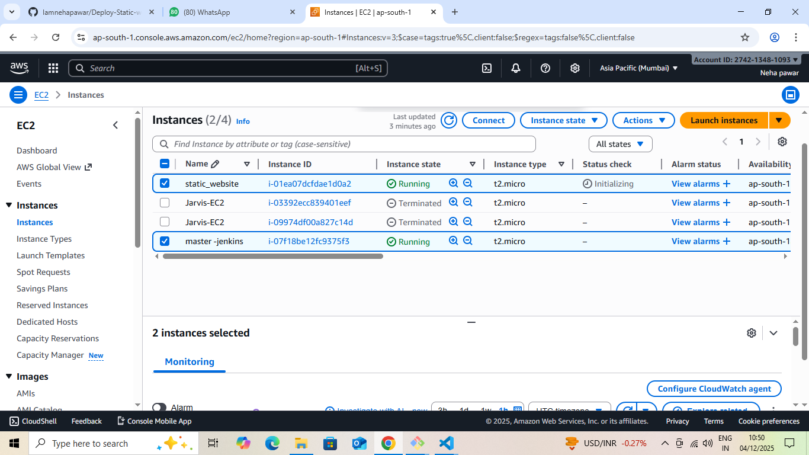

# Static Website on AWS EC2 with Terraform & Jenkins


This project automates the deployment of a static website on an AWS EC2 instance using Terraform and Jenkins.  
Whenever the GitHub repository is updated, Jenkins automatically updates the website on the EC2 server.

## Overview

- Provision an EC2 instance using Terraform  
- Automatically install Apache and Git  
- Deploy a static website from GitHub  
- Automate website updates using Jenkins CI/CD pipeline  

## Tools & Technologies

Terraform · AWS EC2 · Apache · Jenkins · GitHub · Linux · SSH

## Setup & Deployment

### 1. Terraform Provisioning
- Creates an EC2 instance  
- Configures Security Group (Ports 22 & 80 open)  
- Installs Apache and Git using User Data  
- Clones website repository to `/var/www/html`

### 2. Deploy with Terraform

Run the following commands to provision infrastructure:

```bash
terraform init
terraform apply -auto-approve
```

### 3. EC2 Auto Setup (User Data Script)
- Installs Apache and Git  
- Pulls website code from GitHub  
- Sets correct permissions  
- Starts Apache web server  

### 4. Jenkins CI/CD Pipeline
- Detects GitHub code updates via Webhook  
- SSH into EC2 instance  
- Deletes old website files  
- Clones the latest version from GitHub  
- Restarts Apache  
- Website updates instantly  


## Skills Learned

### Cloud / AWS
- EC2 provisioning  
- Security groups  
- Server automation  

### DevOps
- Jenkins pipelines  
- GitHub Webhooks  
- CI/CD automation  

### Terraform
- AWS resource creation  
- EC2 User Data scripting  

### Linux
- Apache web server  
- Shell scripting  
- File permissions  

## Screenshots

- Jenkins Pipeline 
 

- EC2 Server 
 

- Website Output 
 
  
- GitHub Repository  


## Conclusion

Terraform simplifies server provisioning, and Jenkins ensures your website always stays updated with the latest code.  
This project demonstrates a complete automated CI/CD setup for a static website.

## Author

**Neha Pawar**  
Cloud & DevOps Enthusiast  

GitHub: https://github.com/Iamnehapawar  
Email: nehapawar29005@gmail.com

   